<center>

## EIE2 Instruction Set Architecture & Compiler (IAC)
---
## Lab 2 - Signal Generation and Capture Log Book

---

</center>

---
## Task 1 - Simple sinewave generator
---
**Step 1 - Specifying a 256 x 8bit ROM**

In this step, we are first tasked to create the component rom.sv .The rom.sv file is as follows:

```Verilog
module rom #(
    parameter   ADDRESS_WIDTH = 8,
                DATA_WIDTH = 8
)(
    input logic                     clk, 
    input logic [ADDRESS_WIDTH-1:0] addr,
    output logic [DATA_WIDTH-1:0]    dout     
);
logic [DATA_WIDTH-1:0] rom_array [2**ADDRESS_WIDTH-1:0];

initial begin 
    $display("Loading rom.");
    $readmemh("sinerom.mem", rom_array); //opens the sinerom.mem file and pushes values into the rom_array variable
end;

always_ff @(posedge clk)
    //output is synchronous 
    dout <= rom_array [addr];

endmodule
```

We were then tasked to examine the files sinegen.py and sinerom.mem .

```python
//sinegen.py
import math
import string
f = open("sinerom.mem","w") #creates a file containing all 256 values of sine
for i in range(256): #256 because we have 2^8 bits and hence 256 addresses 
    v = int(math.cos(2*3.1416*i/256)*127+127)
    if (i+1)%16 == 0:
        s = "{hex:2X}\n"
    else:
        s = "{hex:2X} "
    f.write(s.format(hex=v))

f.close()
```
It first opens a file that all the values will be stored in. In this case, the file is named "sinerom.mem".

It consists of a simple for loop that calculates the value of: 

$cos(2\pi \times \frac{i}{256}) \times 127 + 127$ 

This for loop calculates 256 values of a cosine wave, that is scaled to amplitude 127 and also shifted vertically by 127. 

It then converts these values to hex, and stores the hex values into the **_sinerom.mem_** file. 

Hence, when we open up the **_sinerom.mem_** file, we see that it contains 256 hex values, each corresponding to a value on a cosine wave. 

**Step 2 - Create the sinegen module**

In this step, we are tasked to create a sinegen.sv module:

<p align="center"> 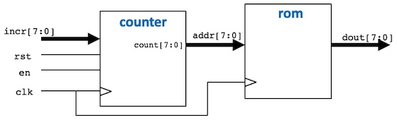 </p>

I implemented this as follows:

```Verilog 
module sinegen #(
    parameter A_WIDTH = 8,
              D_WIDTH = 8
)(
    //interface signals 
    input logic clk, 
    input logic rst, 
    input logic en, 
    input logic [A_WIDTH-1:0] incr,
    output logic [D_WIDTH-1:0] dout
);

    logic [A_WIDTH-1:0] address;

counter addrCounter (
    .clk (clk),
    .rst (rst),
    .en (en),
    .incr (incr),
    .count (address)
);

rom sineRom (
    .clk (clk),
    .addr (address),
    .dout (dout)
);

endmodule
```
I first specified the paramters of the address and data width. Then, I inherited the inputs from both components: **_clk, rst, en, incr_**. There is only one output value here, which is **_dout_**.

The only internal logic is address, the output from the counter. This feeds to the rom and selects the address that we want the data from. 

**Step 3 - Create the testbench for sinegen**

In this step, I created the testbench **_sinegen_tb.cpp_** for **_sinegen.sv_**. 

```c++ 
    //init Vbuddy 
    if(vbdOpen() !=1) return(-1);
    vbdHeader("Lab 2: Sine Generator");

    //initialise simulation inputs
    top->clk = 1;
    top->rst = 1;
    top->en = 0;
    top->incr = 1; //initial set incr to 1

    //run simulation for many clock cycles 
    for (i=0; i<1000000; i++){

        for(clk = 0; clk < 2; clk++){
            tfp->dump (2*i+clk);
            top->clk = !top->clk;
            top->eval ();
        }

        // Plot dout scaled between 0 and 255 on TFT screen on next x coord. When x reaches 255, screen is cleared and x starts from 0 again.
        vbdPlot(int(top->dout),0,255);

        // Report the cycle count on bottom right of TFT screen
        vbdCycle(i+1);
        
        top->rst = (i < 2) | (i == 15);

        //make vbdFlag control en input 
        top->en = vbdFlag();

        // either simulation finished, or 'q' is pressed
        if ((Verilated::gotFinish()) || (vbdGetkey()=='q')) 
        exit(0);                // ... exit if finish OR 'q' pressed
    }   
```

I also created the doit.sh file, which is simply changing the file names. 

See photo below on the output on Vbuddy:
<p align="center"> 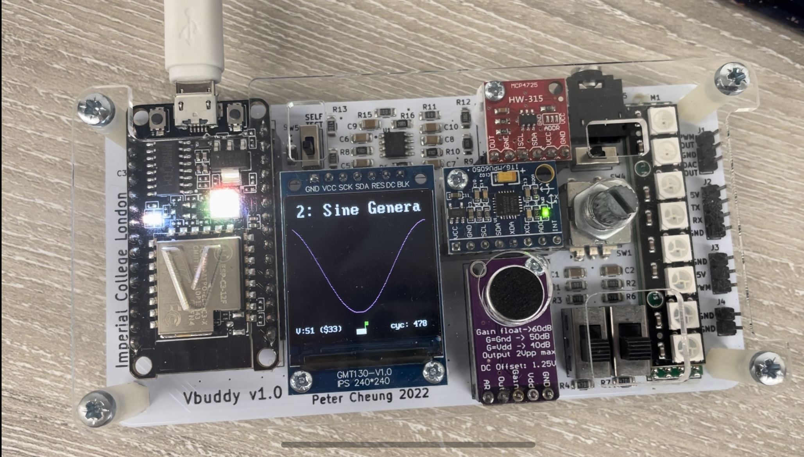 </p>

The graph here is smooth because I set the increment to 1. Therefore the count will only increment by one each cycle, giving sequential addresses to the rom and hence sequential values of a cosine wave as dout. 

For the challenge part, I added another line: 
```Verilog 
//allow vbdValue() control the value of incr
        top->incr = vbdValue();
```
See photos: 
<p align="center"> 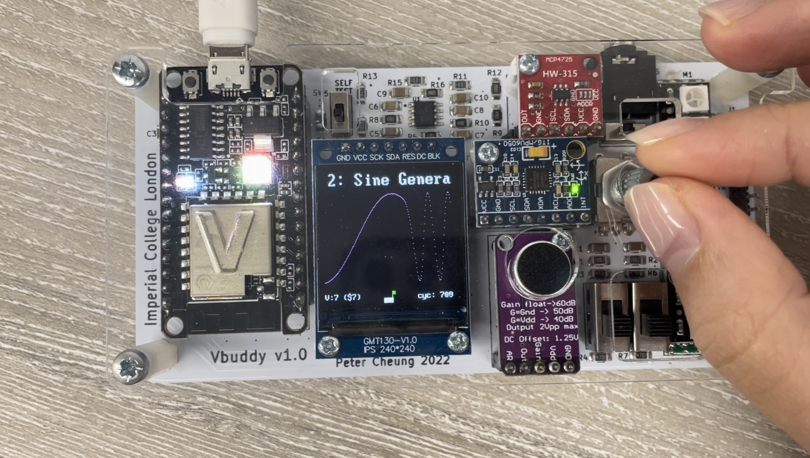 </p>

We see that turning the rotary button and increasing the value of vbdValue() causes the sine wave formed to be more dotty: this is because the increment is larger than 1, and more values are getting "skipped over"

<p align="center"> 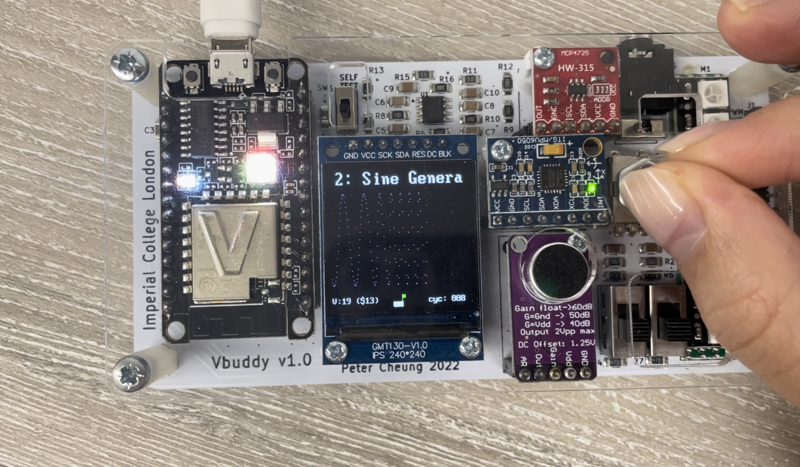 </p>

The further we increase the value of incr, it seems like the frequency of the sine wave formed. However, it does not make sense as we are still taking values from the same cos wave. This means that these waves we see are aliased. 

If the sampling frequency when incr = 1: $f_{samp} = \frac{256}{T}$, now we are taking less samples as we skip over some values of cos (e.g.): $f_{samp} = \frac{50}{T}$. This means that $f_{samp}$ may not satisfy the Nyquist Sampling Criteria, which states that $f_{samp} < 2f_{signal}$.

---
## Task 2 - Sine and Cosine Dual Wave Generation
---

We want to create 2 waves at the same time in this task. This means that our counter must be able to output 2 addresses at once, and our ROM must be dual-port (2 addr inputs, 2 douts).

We create a **_rom2ports.sv_** module: 

```Verilog
module rom2ports #(
    parameter   ADDRESS_WIDTH = 8,
                DATA_WIDTH = 8
)(
    input logic                     clk, 
    input logic [ADDRESS_WIDTH-1:0] addr1,
    input logic [ADDRESS_WIDTH-1:0] addr2,
    output logic [DATA_WIDTH-1:0]   dout1,
    output logic [DATA_WIDTH-1:0]   dout2     
);
logic [DATA_WIDTH-1:0] rom_array [2**ADDRESS_WIDTH-1:0];

initial begin 
    $display("Loading rom.");
    $readmemh("sinerom.mem", rom_array); //opens the sinerom.mem file and pushes values into the rom_array variable
end;

always_ff @(posedge clk) begin
    //output is synchronous 
    dout1 <= rom_array [addr1];
    dout2 <= rom_array [addr2];
end
endmodule

```
This rom is now able to read 2 addresses and output 2 data lines in one clock cycle. 

Similarily, we must edit the counter module such that it is able to output 2 count values that correspond to the 2 addresses. 

```Verilog
module counteroffset #(
    parameter WIDTH = 8
)(
    //interface signals 
    input logic                 clk,    //clk
    input logic                 rst,    //reset 
    input logic                 en,     //counter enable 
    input logic  [WIDTH-1:0]    offset, //offset between the 2 signals
    output logic [WIDTH-1:0]    count1, //addr for port 1
    output logic [WIDTH-1:0]    count2  //addr for port 2 
);

always_ff @ (posedge clk)
    if (rst) begin       
    count1 <= {WIDTH{1'b0}};
    count2 <= {WIDTH{1'b0}}; 
    end 

    else if(en) begin 
        count1 <= count1 + {WIDTH{1'b1}}; 
        count2 <= count1 + {WIDTH{1'b1}} + offset;
    end 

endmodule

```
In this counter module, we have 2 outputs: **_count1_** and **_count2_**. 

```Verilog
count2 <= count1 + {WIDTH{1'b1}} + offset;
```
This line ensures that count2 constantly maintains the same offset from count1.

The next *_sinegen2.sv_* module combines the new counter and dual port ram to output 2 separate values of dout in one clock cycle. 

```Verilog
module sinegen2 #(
    parameter A_WIDTH = 8,
              D_WIDTH = 8
)(
    //interface signals 
    input logic clk, 
    input logic rst, 
    input logic en, 
    input logic [A_WIDTH-1:0] offset,
    output logic [D_WIDTH-1:0] dout1,
    output logic [D_WIDTH-1:0] dout2
);

    logic [A_WIDTH-1:0] addr1;
    logic [A_WIDTH-1:0] addr2;

counteroffset addrCounter (
    .clk (clk),
    .rst (rst),
    .en (en),
    .offset (offset),
    .count1 (addr1),
    .count2 (addr2)
);

rom2ports dualportrom (
    .clk (clk),
    .addr1 (addr1),
    .addr2 (addr2),
    .dout1 (dout1),
    .dout2 (dout2)
);

endmodule

```
This implements: 
<p align="center"> 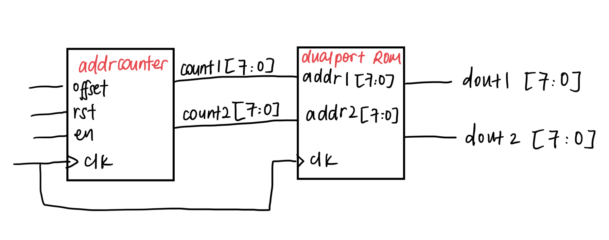 </p>

Testbench is as follows:
```c++
#include "Vsinegen2.h"
#include "verilated.h"
#include "verilated_vcd_c.h"
#include "vbuddy.cpp"

int main(int argc, char **argv, char **env) {
    int i;
    int clk;

    Verilated::commandArgs(argc, argv);

    // init top verilog instance
    Vsinegen2* top = new Vsinegen2;

    //init trace dump
    Verilated::traceEverOn(true);
    VerilatedVcdC* tfp = new VerilatedVcdC;
    top->trace (tfp, 99);
    tfp->open ("sinegen2.vcd");

    //init Vbuddy 
    if(vbdOpen() !=1) return(-1);
    vbdHeader("Lab 2: 2 Sine");

    //initialise simulation inputs
    top->clk = 1;
    top->rst = 1;
    top->en = 0;
    top->offset = 64; //initial set offset to 64

    //run simulation for many clock cycles 
    for (i=0; i<1000000; i++){

        for(clk = 0; clk < 2; clk++){
            tfp->dump (2*i+clk);
            top->clk = !top->clk;
            top->eval ();
        }

        vbdPlot(int(top->dout1),0,255);
        vbdPlot(int(top->dout2),0,255);

        vbdCycle(i+1);
        
        top->rst = (i < 2) | (i == 15);
        top->en = vbdFlag();

        //make vbdValue() control the value of offset
        top->offset = vbdValue();

        // either simulation finished, or 'q' is pressed
        if ((Verilated::gotFinish()) || (vbdGetkey()=='q')) 
        exit(0);                // ... exit if finish OR 'q' pressed
    }   
    
    vbdClose();
    tfp->close();
    exit(0);
}
```
```cpp
    vbdPlot(int(top->dout1),0,255);
    vbdPlot(int(top->dout2),0,255);
```
These 2 lines call vbdPlot() twice but for different y values. 

The offset is also read from Vbuddy with the vbdValue() function.

We can see the 2 waves being generated here:
<p align="center"> 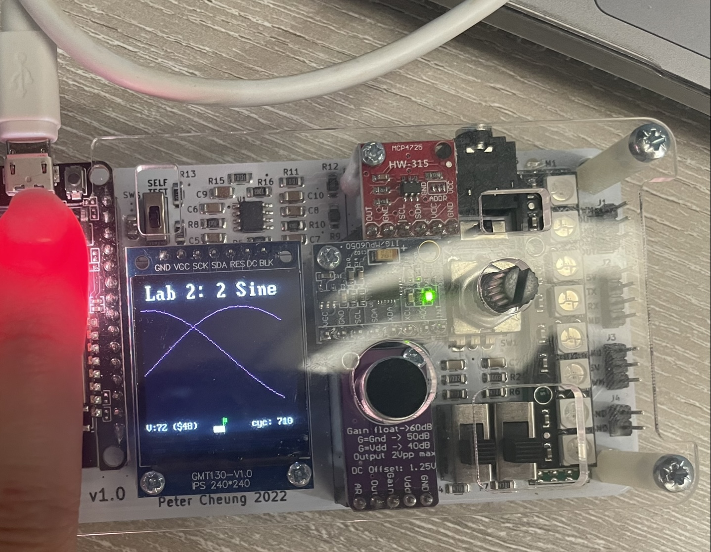 </p>

By setting the offset to 64, we are creating 2 waves with a 90 degree offset between them. This is because one wave will always lead by $\frac{64}{256} \times 2\pi= \frac{1}{4} \times 2\pi = \frac{\pi}{2} = 90°$

<p align="center"> 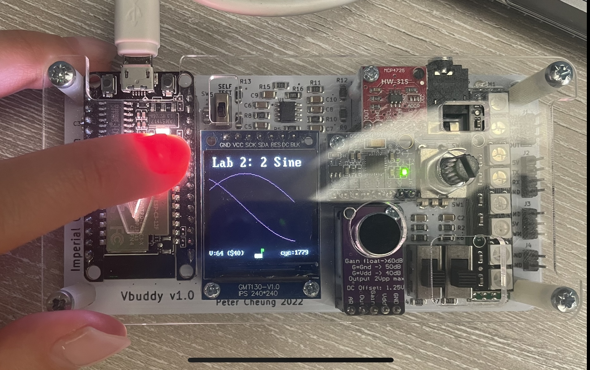 </p>

If we zoom out, these 2 graphs will show: 

<p align="center"> 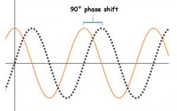 </p>

---
## Task 3 - Capture and display audio signal in RAM
---

Task 3 requires us to capture and display real audio signal using the microphone/amplifier module on Vbuddy. 

At the same time as capturing and displaying the audio signal on the Vbuddy screen, we also want to display the same audio signal but delayed.

This means that while we are capturing the current audio values and storing it into a RAM, we also need to read its previous value from the RAM and output it on the Vbuddy display. 

As such, we need a dual port RAM. 
<p align="center"> 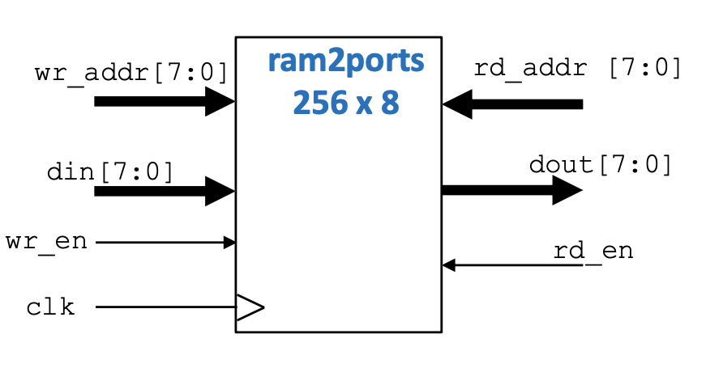 </p>

The **_ram2ports.sv_** file is:
```Verilog 
module ram2ports #(
    parameter   ADDRESS_WIDTH = 8,
                DATA_WIDTH = 8
)(
    input logic                         clk, 
    input logic                         wr_en, 
    input logic                         rd_en, 
    input logic     [ADDRESS_WIDTH-1:0] wr_addr,
    input logic     [ADDRESS_WIDTH-1:0] rd_addr,
    input logic     [DATA_WIDTH-1:0]    din, 
    output logic    [DATA_WIDTH-1:0]    dout
);

logic [DATA_WIDTH-1:0] ram_array [2**ADDRESS_WIDTH-1:0];

always_ff @(posedge clk) begin 
    if (wr_en == 1'b1)
        ram_array[wr_addr] <= din;
    if (rd_en == 1'b1)
        dout <= ram_array[rd_addr];
end 

endmodule 

```
We can also use the same offset counter from the previous task, but with a small change: 

```Verilog 
count2 <= count1 + {WIDTH{1'b1}} - offset;
```

Instead of adding the offset, we minus offset from count2.

Count 2 is the address of the read address in RAM. Since we want a _delayed_ signal, the address we read from should be an address _before_ the current one that we are storing data in.

The **_sigdelay.sv_** module should simulate this:
<p align="center"> 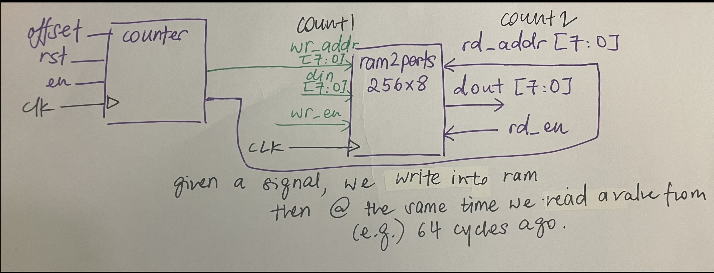 </p>

From the given testbench, I could infer that there was only one output: **_delayed_signal_**, and a new input **_mic_signal_**

The **_sigdelay.sv_** module is:
```Verilog 
module sigdelay #(
    parameter   A_WIDTH = 8,
                D_WIDTH = 8
)(
    input logic                     clk,
    input logic                     rst, 
    input logic                     wr, 
    input logic                     rd, 
    input logic     [A_WIDTH-1:0]   offset, 
    input logic     [D_WIDTH-1:0]   mic_signal,
    output logic    [D_WIDTH-1:0]   delayed_signal 
);

logic [A_WIDTH-1:0] count1;
logic [A_WIDTH-1:0] count2;

counteroffset counter2 (clk, rst, offset, count1, count2);
ram2ports ram2 (clk,wr,rd,count1,count2, mic_signal, delayed_signal);

endmodule

```

Some new functions from the testbench are: 
```C++
  // intialize variables for analogue output
  vbdInitMicIn(RAM_SZ);
  
  // ask Vbuddy to return the next audio sample
  top->mic_signal = vbdMicValue();
```
It is important to note that the offset is set to 64 and is kept this way throughout the simulation cycle. 

Testing of the module showed that it was working: 

1. Initial few cycles: 
* Expected that the mic_signal wave would show a signal 
* The delayed signal should just be a straight line, as there are insufficient values stored in the RAM for it to read and print. 

<p align="center"> 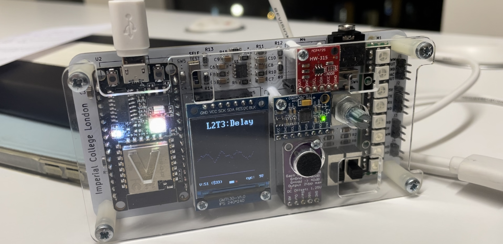 </p>
*After a few cycles, delayed signal showed changes:
<p align="center">  </p>

2. When both signals are changing, I started a tone generator that generates a sine wave. 
* See in this picture that the mic_signal wave picks up on the sine wave first, 

<p align="center"> 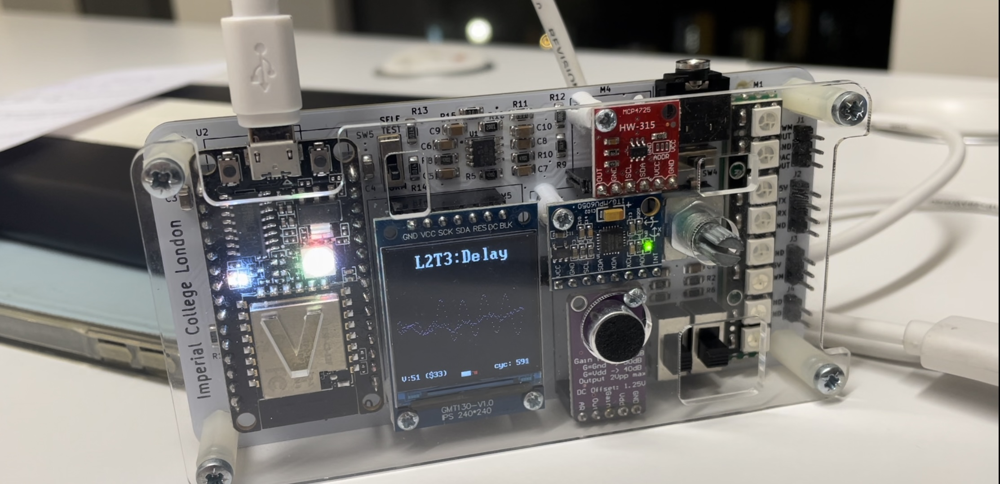 </p>

*Then after a few cycles the delayed signal also prints a sine wave.
<p align="center"> 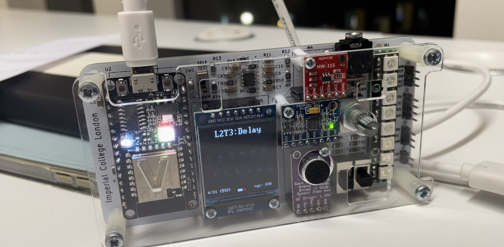 </p>

3. Finally, turn off the tone generator. 
* See that the mic_signal goes back to an incomprehensible wave
* Whereas the delayed signal still shows a sine wave for a few cycles. 
<p align="center"> 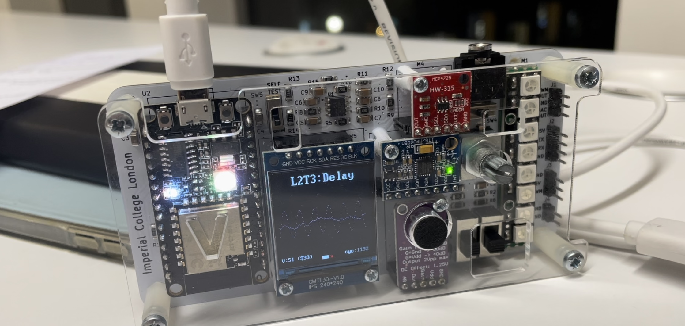 </p>
* Until finally they both stop showing the sine wave
<p align="center"> 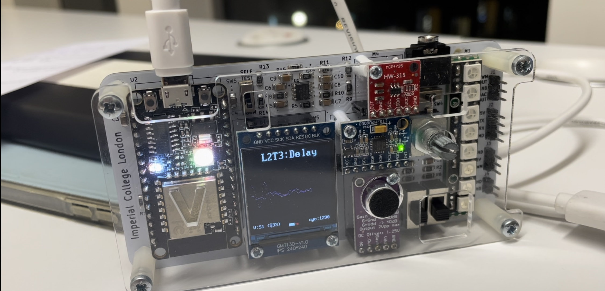 </p>